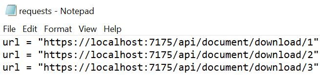

#  Parallel Requests from Command Prompt
curl [options / URLs]

---
# Introduction
Say you need to make parallel requests to an endpoint. You don't want to set up a new console application project or maybe you are on a very restrict server where you don't even have access to copy files over in an easy way, maybe this endpoint can only be accessed locally, well we have plenty of scenarios this simple approach might be helpful.

---
# Parallel Request - Command Prompt
```cmd
curl --parallel --parallel-immediate --parallel-max 5 www.google.com
```

---
# --parallel
 Makes curl perform its transfers in parallel as compared to the regular serial manner.

---
# --parallel-immediate

With --parallel-immediate, curl is instructed to reverse the prioritization and instead prefer creating a new connection immediately rather than risk waiting a little to see if the transfer can be multiplexed of another connection.

---
# --parallel-max <num>
When asked to do parallel transfers, using --parallel, this option controls the maximum amount of transfers to do simultaneously.

---
# --parallel-immediate
 When doing parallel transfers, this option will instruct curl that it should rather prefer opening up more connections in parallel at once rather than waiting to see if new transfers can be added as multiplexed streams on another connection.

---
# Bonus
with --config parameter you can specify a txt file with the urls you want to hit.
```
curl --parallel --parallel-immediate --parallel-max 5 --config requests.txt
```
